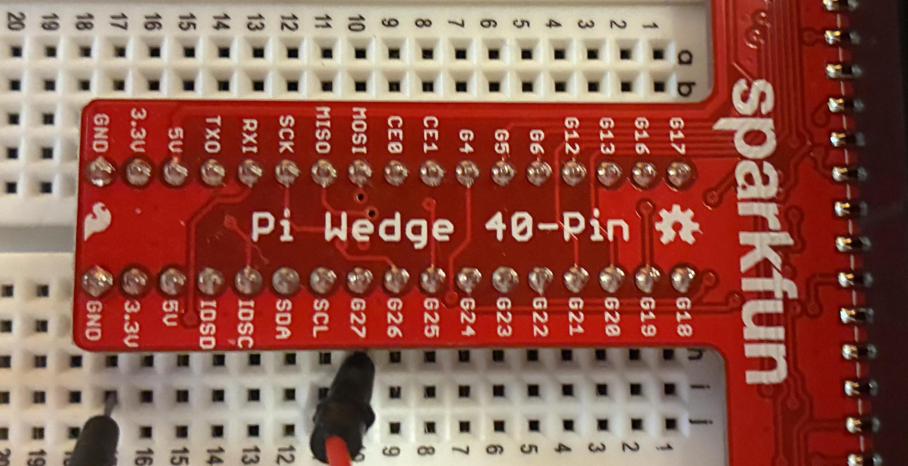

# Overview

This is a tool for examining and manipulating memory mapped registers in embedded devices via symbolic
names instead of raw addresses.  
The program reads a register configuration file in yaml format which contains register definitions.  

# Usage

```bash
register_tool [options] <path>[=<value>]...
```

# Building

## aarch64-unknown-linux-gnu

Suitable for executing on a raspberrypi OS, or ubuntu

```bash
git clone https://https://github.com/AndrewOfC/register_tool.git --recursive
cd register_tool
rustup target add aarch64-unknown-linux-gnu # once
cargo build --target aarch64-unknown-linux-gnu
```


# Parameters and options

| P/O       | meaning                                                       |
|-----------|---------------------------------------------------------------|
| path      | path to register definition                                   |
| value     | hex, octal or binary value to set register to                 |
| -d        | Dump the register definition, do not set or read              |
| -f <file> | Override register file(s) that might be in REGISTER_TOOL_PATH |
| -t        | Test mode.  Do not map memory, allocate a block of 'length'   |


# Concepts

## Path

A 'path' describes the location of a register in the yaml definition file.  The notion is similar
to dereferencing a python or javascript object.  A dot(.) will access fields in an associative array
or hash block and [] may be used to access individual array members.


### Example

```yaml
GPIO:
    pins:
         # 0 
         - set:
              offset: 0x1C
              bits: 31:31
           clear:
              offset: 0x28
              bits: 31:31
         # 1     
         - set:
              offset: 0x1C
              bits: 30:30
           clear:
              offset: 0x28
              bits: 30:30
```

__GPIO.pins[0]__

will access the pin 0


## Bits

Bits are specified by "hibit:lobit" (inclusive).  This allows you to set/clear bits individually in a 
regsiter without changing the other bits in he register.  Example to set pin 1 in the above exmple
this command would be used:

```bash
register_tool GPIO.pins[0].set=1
```

Inside register tool, the current

# Environment Variables:

| Var | Effect                                                               |
|-----|----------------------------------------------------------------------|
| REGISTER_TOOL_PATH    | colon separated list of directories to search for register_tool.yaml |

# How To

## Define a device

The root of your yaml configuration file should contain the following fields

```yaml
base: 0x7E200000
length: 0x2000
device: "/dev/gpiomem"
```

| field  | value                                                  |
|--------|--------------------------------------------------------|
| base   | base addrewss to apply with mmap                       |
| length | length to apply to mmap                                |
| device | path to device to open for mmap.  Defaults to /dev/mem |


## Define a register
Registers may be defined in any hierarchy that makes sense for your project.  They can also be duplicated and aliased
for convenience.

```yaml
completion-metadata:
  root: "registers"
  terminal-fields: ["offset", "bits"]

base: 0x0000 # base address
length: 0x2000

registers:
  GPIO:
     
      register:
          offset: 0x00 
          read-write:  rw|ro|wo|w1c
          description: general purpose input/output

      pin:
          bits: hi:lo # inclusive
          parent: "GPIO.register"          
```

### Register Definition
| Field       | Purpose                                                                                                                                                                  |
|-------------|--------------------------------------------------------------------------------------------------------------------------------------------------------------------------|
| offset      | offset from memory base  (required)                                                                                                                                      |
| bits        | hibit:lobit selection of individual bits in a word(inclusive)<br> 31:31 first bit in register<br>1:0 last two bits                                                       |
| read-write  | rw: read-write<br>ro: read-only<br>wo: write only<br>w1c: write-once-to-clear                                                                                            |
| description | Description of register                                                                                                                                                  |
| parent      | If a required field is not found, parent will be checked(recursive). This is a path from the defined root.                                                               |
| shadow      | In the case of write-only registers, if there is a register that can be read to provide the current state, it may be specified here as a path to the shadowing register. |


## completion-metadata
This is information that the [ucompleter](https://github.com/AndrewOfC/ucompleter) tool will use to provide completions of your registers
on the bash command line. It is not required, but it is recommended.

| Field           | Purpose                                                                                      |
|-----------------|----------------------------------------------------------------------------------------------|
| root            | Path to the element where register definitions are to be found                               |
| terminal-fields | If any of these fields are present in a hash as the tree is descended the descent is stopped | 

# Example Files

| File                                              | Contents                                 |
|---------------------------------------------------|------------------------------------------|
| [raspberrypi4b_source.yaml](examples/raspberrypi4b_source.yaml) | Register definitions for RaspberryPi 4b This file was constructed with data from: [bcm2711-peripherals.pdf](https://datasheets.raspberrypi.com/bcm2711/bcm2711-peripherals.pdf)|
| [raspberrypi4b.yaml](examples/raspberrypi4b.yaml) |  The raspberrypi4b_source.yaml file remapped for a 'per pin' perspective.                                                                                                                                                                              |

# Companion tools

The ucompleter tool can be configured with bash to provide register completions. 
Once enabled pressing TAB-TAB after register_tool will provide you with the available completions

```bash
complete -o bashdefault -o default -o nospace  -C ucompleter register_tool 
```

# Example

To toggle GPIO pin 27 on a RaspberryPi 4b using a [SparkFun PiWedge](https://www.sparkfun.com/sparkfun-pi-wedge.html)

```
register_tool GPIO.pins[27].function=1 # configures for output
register_tool GPIO.pins[27].set=1 # sets pin 27 hi
register_tool GPIO.pins[27].clear=1 # sets pin 27 lo
```

# Layout

| Dir                  | Contents                                                           |
|----------------------|--------------------------------------------------------------------|
| [examples](examples) | examples of register files                                         |   
| [python](python)     | python helper files for rendering register files<br>(not deployed) |
| src                  | Rust source code                                                   |
| target               | cargo output directory                                             |
| [tools](tools)       | Optional tools that can assist with use                            |
